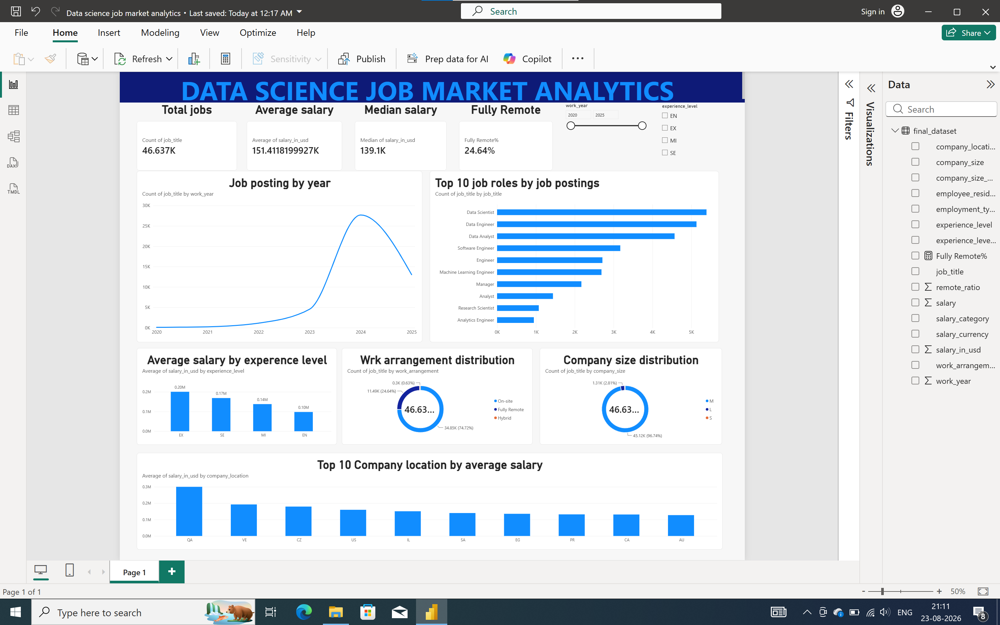
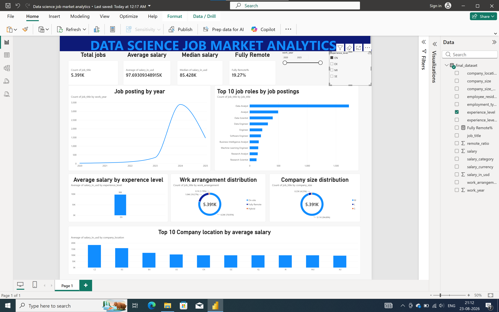

# Data Science Job Market & Salary Analytics

## 📌 Project Overview

This project analyzes global data science job postings to understand job demand, salary trends, experience levels, remote work, company size, and geographic patterns.

The project combines Python, SQL, SQLite, and Power BI to transform raw job-market data into meaningful insights and an interactive dashboard.

## 🎯 Objectives

- Analyze trends in data science job postings
- Identify the most in-demand job roles
- Compare salaries across experience levels
- Analyze remote, hybrid, and on-site opportunities
- Identify major job-posting locations
- Explore salary differences across locations and company sizes
- Build an interactive Power BI dashboard

## 📊 Dataset

- Total job postings analyzed: **46,637**
- Years covered: **2020–2025**
- Job titles: **300+**
- Company locations: **90**
- Employee residence locations: **90+**

## 🛠️ Tools & Technologies

- **Python**
- **Pandas**
- **Jupyter Notebook**
- **SQL**
- **SQLite**
- **Power BI**
- **Microsoft Excel/CSV**

## 🔄 Project Workflow

Raw Dataset
     ↓
Data Cleaning & Preprocessing
     ↓
Exploratory Data Analysis (Python)
     ↓
SQL Analysis using SQLite in Jupyter notebook
     ↓
Power BI Dashboard
     ↓
Business Insights

## 📊 Power BI Dashboard

### Dashboard Overview

### Job Market & Salary Analysis

